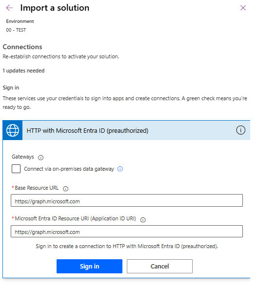

# Get-Drive-Ids-from-SharePoint-Online
Canvas App + instant flows to get Drive Ids for SPO Lists / Libraries and its Items.

## Why is this useful to you?
If you make apps with Power Platform, you often work with SharePoint Online or OneDrive.

If you develop using healthy ALM practices (DEV / TEST / PROD), you are probably going through the pain of finding the **Drive IDs** for a SharePoint library or a file.

If you use a lot of Office Scripts stored in SharePoint libraries, this can be especially annoying.

This App makes it easy. you will be able to navigate through your Sites, Lists/Libraries and Items to retrieve those IDs in a very straightforward manner.

## Installation
Import the solution package in the Environment of your choice.

Don't forget to authenticate your HTTP with Microsoft Entra ID (preauthorized) connector:

## Trademarks
This project may contain trademarks or logos for projects, products, or services. Authorized use of Microsoft trademarks or logos is subject to and must follow Microsoft's [Trademark & Brand Guidelines](https://www.microsoft.com/en-us/legal/intellectualproperty/trademarks). Use of Microsoft trademarks or logos in modified versions of this project must not cause confusion or imply Microsoft sponsorship. Any use of third-party trademarks or logos are subject to those third-party's policies.
